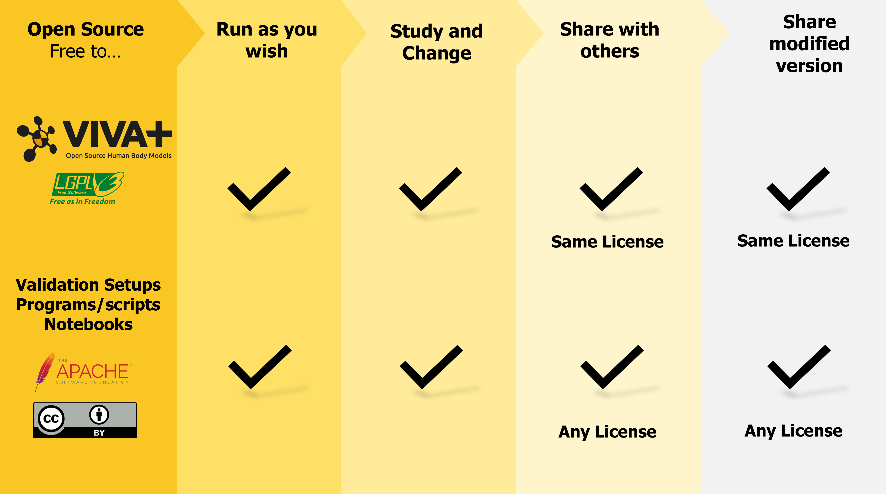

# Open Science

The VIVA+ Ecosystem makes an attempt to faciliate Open Science with Open Source models, postprocessing with computational notebooks, and open repositories to enable a collaborative scientific community.

## **Open Source**

VIVA+ ecosystem (models and validation repositories) is available under free and open-source licenses. Not only are the models available under no cost to the user, but the user also has the freedom to[^free]: 

- use the VIVA+ model as they wish, for any purpose.
- investigate the models and modify it to suit your particular need or application
- redistribute copies as needed
- distribute copies of your modified versions to others[^TM].By doing this, you can give the whole community a chance to benefit from your changes. You are also welcome to contribute back to the VIVA+. (Check with the Maintainer team to see if your contributions fit into the VIVA+ roadmap.)

Here is an overview of the **freedoms** that are provided to you through the licenses used by the VIVA+ ecosystem.

Open source harnesses the power of distributed **peer review** and **transparency of process**. The promise of open source is **higher quality**, **better reliability**, and **greater flexibility**[^OS]. We believe Open Source creates symbiotic relationships where we can explore and implement new ideas in a collaborative way.

[^OS]: https://opensource.org/about

[^free]: The four essential freedoms as envisioned in "Free Software Definition"
[^TM]: **The VIVA+ trademark is held by OVTO**. Redistributing modified version may be done under a different name.

!!! success annotate "Why choose open source? (1)"

    Users prefer open source over proprietary options for the many benefits it offers[^redhat]. Here are some common ones:

    [^redhat]: Adapted from https://www.redhat.com/en/topics/open-source/what-is-open-source

    - **Peer review**: As a scientific community, we value peer review for the reliability it brings to the scientific process. The models are freely accessible and this opens avenues for it to be actively checked and continuously improved by peers - users and developers. 
    - **Transparency**: Need to know the exact material definition and what's changed between versions? You can check and track for yourself.
    - **Open collaboration**: Work with open science communities spread globally without any limitations.
    - **Flexibility**: Because of its emphasis on modification, you can use the VIVA+ models to address problems that are unique to your research and use-cases. You aren’t locked in, and you can rely on community help and peer review.
    - **No cost**: With open source, the model are free-of-cost
    - **No lock-in**: Freedom for the user means that you can use the models anywhere, and use it for anything, at anytime.

1. :man_raising_hand: Check out the FAQs page if you have questions about using open source for your application

## **Reproducibility and Replicability**

Having the models open source with no restrictions on reuse or resharing is the best way to ensure the reproducibility of the models, while ensuring that responses can be compared for replicability with other models also.