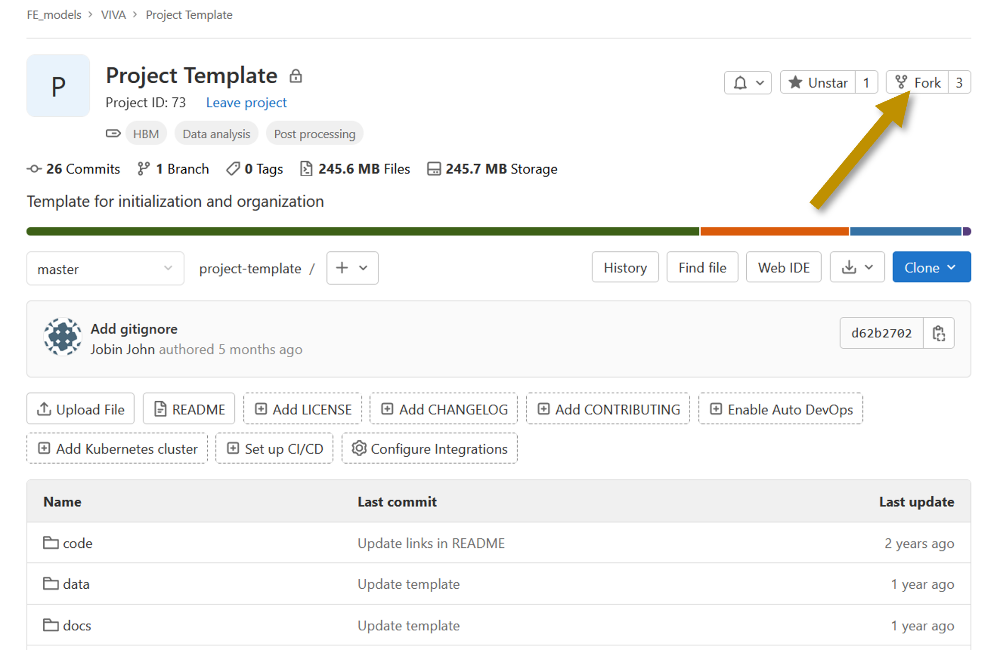

# Positioned Models

We maintain a collection of positioned models. These models are available at https://openvt.eu/fem/viva/positioned-models

If you would like to contribute to the VIVA+ library by sharing your positioned models, follow the steps below. 

Get in touch with VIVA+ maintainers/user community either on [Zulip](https://vivaplus.zulipchat.com/#narrow/stream/356290-Positioning/topic/Positioned.20Models) or by creating an [issue](https://openvt.eu/fem/viva/vivaplus/-/issues/new?issue%5Bmilestone_id%5D=) on the VIVA+ repo

## 1. Fork the VIVA+ project template

Fork the VIVA+ project template to get a copy of the template. This is the repository where you will update the model to the positioned model.

## 2. Update the `vivaplus` folder 

Update the base model with the new node coordinates of the positioned models. Edit the `README` to describe the position.

## 3. Let the maintainers know

If you have created an issue already, paste the link to your repo on the issue and mark the issue as ready. It is a good practice to leave a running example in your repository. Your models will be made available in the [Positioned Models library](https://openvt.eu/fem/viva/positioned-models)