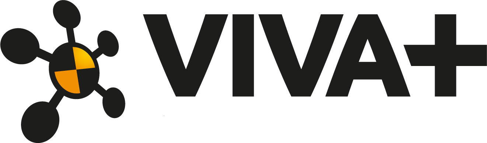

---
hide:
  - navigation
  - toc
---


<center>
 
</center>

<center>
 
</center>

<h1><center>Open Source Finite Element Models for Injury Assessment </center></h1>


<div class="grid cards" markdown>


-   :octicons-unlock-16:{ .lg .middle } __Open Source__

    ---

    :material-download: [__Download and Get Started__](./index.md#getting-started) right away!
    
    :material-rocket-launch: __No restrictions__ to use/modify. Check out [FAQs](./about/faq.md#open-source)


    :material-test-tube:__Open Science__: [Validation Catalog](https://vivaplus-validation.readthedocs.io/) available


-   :material-walk:{ .lg .middle } __Safety for everyone__

    ---

    :material-human-female: First Open source __Average female__ model.

    :material-human-male-female: __Average Male__ and the __Standing__ models to represent all road users.

    <!-- :material-bike-fast::material-seat-recline-extra: Also find more models _positioned_ and _morphed_ by the community (cyclists, e-scooter riders, ... ) -->


-   :material-scale-balance:{ .lg .middle } __Selectively Detailed Models__

    ---

    :material-seatbelt: focus on **skeletal injury assessment**

    :material-tools: prioritize **robustness**

    :material-clock-fast: ensure **efficiency**

</div>

## **Getting Started**

### **Download**

[:material-download: Download VIVA+ Models ](https://zenodo.org/records/15029163/files/vivaplus-v2.0.0.zip?download=1){ .md-button .md-button--primary }

**[This is the new version (v2.x) - with the new lumbar spine and head]**


??? info "Looking for previous versions?"

     [**:material-download: Download v1.1.1 here**](https://zenodo.org/records/13739228/files/vivaplus-v1.1.1.zip?download=1)

### **Where do I find the models?**

Go to the folder `model`. In the subfolder `50F-seated`, you will find the **seated female**. Also in the `model` folder, you will find the **seated male** and the **standing** female and male models.

- `vivaplus-50F.key` or similar is the main file.
- The model is divided into many `include` files for a modular file structuring. Most of these `include` files are located in the `common` subfolder and are shared between the female/male seated and standing models. For more information on how the model definitions are organized, including the identifiers in the models, see [the documentation page on model structuring :octicons-arrow-right-24:](./model/data-structure.md)

### **Validation catalog**

The model validation catalog is published at https://vivaplus-validation.readthedocs.io/ and the validation setups are also made available openly.


- For more information, refer to the [About](about/index.md) and [Model Documentation](model/index.md) sections of this documentation.
- The models are hosted and maintained on [OpenVT](https://openvt.eu/fem/viva/vivaplus). Previous stable releases can be downloaded from [Zenodo](https://doi.org/10.5281/zenodo.7789362).


<!-- - Find the **users' community** on Zulip [](https://vivaplus.zulipchat.com) -->


!!! warning ""
    
    **Questions?** Contact us at vivaplus@ovto.org or let us know by starting an [issue](https://openvt.eu/fem/viva/vivaplus/-/issues/new?issue%5Bassignee_id%5D=&issue%5Bmilestone_id%5D=) on OpenVT

### **Open Source**

VIVA+ Human Body Models are openly available under the LGPL v3 license  <a href="https://www.gnu.org/licenses/lgpl-3.0-standalone.html"> </a>
, which means the models are freely available to use without any restriction on reuse. See the FAQs(1) and Open Science(2) pages for more information.
{ .annotate }

1. :man_raising_hand: [Frequently asked questions](about/faq.md) in the About Section
2. :woman_raising_hand: [Open Science](about/open-science.md) in the About section


This documentation and the validation catalog are licensed under a **Creative Commons Attribution 4.0** International License [](http://creativecommons.org/licenses/by/4.0/)

## **How to cite**

If you use the models, consider citing the [**"Hello, World!" article**](https://www.frontiersin.org/articles/10.3389/fbioe.2022.918904/full) where we present the concept and development of VIVA+ models and publications on the model validations relevant for your work.

??? abstract "Citation (BiBTeX)"

    ```
    @Article{John2022,
      AUTHOR = {John, Jobin and Klug, Corina and Kranjec, Matej and Svenning, Erik and Iraeus, Johan},   
      TITLE = {Hello, world! VIVA+: A human body model lineup to evaluate sex-differences in crash protection},      
      JOURNAL = {Frontiers in Bioengineering and Biotechnology},      
      VOLUME = {10},           
      YEAR = {2022},        
      URL = {https://www.frontiersin.org/articles/10.3389/fbioe.2022.918904},       
      DOI = {10.3389/fbioe.2022.918904}, 
    }

    ```

## **Acknowledgements**

{: style="width:450px"}

See [projectvirtual.eu](https://projectvirtual.eu/) for more details.

<!-- ### **Sustainable Development Goals** -->

<p float="left">
  
   
  
  
</p>